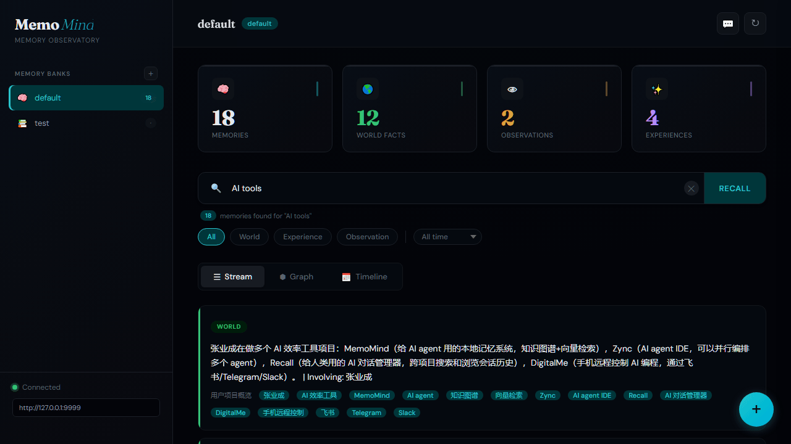
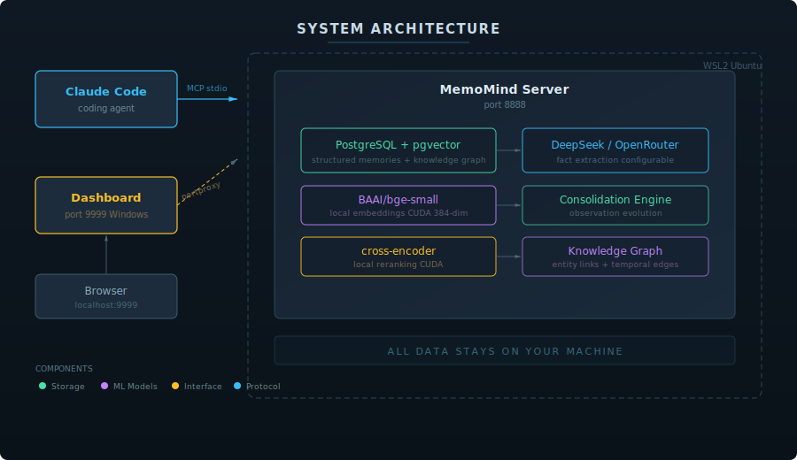
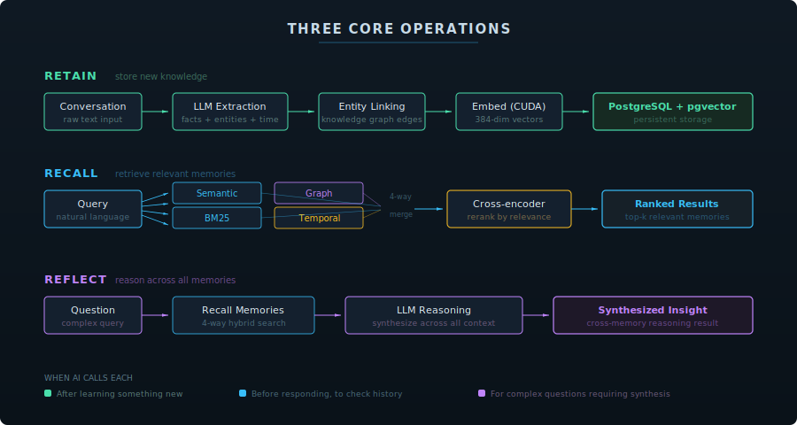
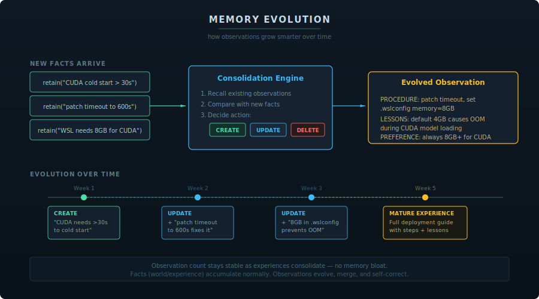
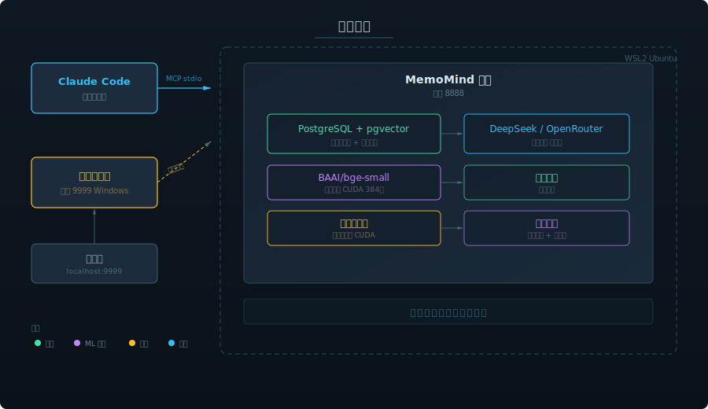
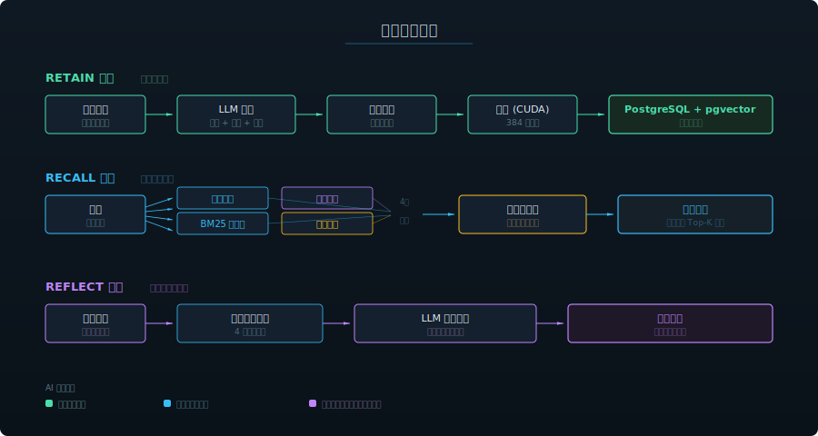
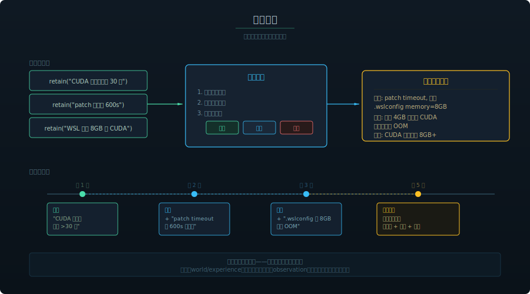

<div align="center">


# 🧠 MemoMind

**Give your AI agent a brain that remembers.**

*A fully local, GPU-accelerated memory system for Claude Code and AI coding assistants.*

[](LICENSE)
[](https://learn.microsoft.com/en-us/windows/wsl/)
[](https://github.com/pgvector/pgvector)
[-blue)](https://modelcontextprotocol.io/)
[](https://developer.nvidia.com/cuda-toolkit)
[](http://127.0.0.1:9999)

[English](#two-kinds-of-ai-memory) | [中文](#两种-ai-记忆)

</div>

---

## Two Kinds of AI Memory

AI memory has two audiences — **the machine** and **the human**. Most tools only address one:

| | For the AI (what it knows) | For the Human (what you can review) |
|---|---|---|
| **Goal** | AI remembers preferences, decisions, context across sessions | You browse, search, and manage conversation history |
| **Problem solved** | "Why does it keep forgetting my coding style?" | "What did we discuss last Tuesday?" |

MemoMind handles the **AI side** — it gives your coding agent persistent, structured, intelligent memory. For the human side, see [Recall](https://github.com/24kchengYe/Recall) (our companion project for conversation history management).

**Use both together for the complete experience.**

---

## The Problem

You've been there. Every developer who uses AI coding assistants has been there.

- You spend **20 minutes** explaining your project's architecture — then the session ends. Tomorrow? It's a stranger again.
- You tell it "I prefer functional style" for the **fifth time this week**. It still writes classes.
- You made an important decision last Tuesday — FastAPI over Express. The AI has **zero memory** of it.
- Your coding conventions, your team's naming rules, your deployment pipeline — all gone. **Every. Single. Session.**

The most powerful AI in the world has the memory of a goldfish.

## Why Not Just Use CLAUDE.md?

Claude Code already has `CLAUDE.md` and `MEMORY.md`. But they have fundamental limitations:

| | Claude Code Built-in | MemoMind |
|---|---|---|
| **Storage** | Plain Markdown files | PostgreSQL + pgvector + knowledge graph |
| **Extraction** | Manual — you write rules yourself | Automatic — LLM extracts facts from conversations |
| **Retrieval** | Full file loaded into context every time (wastes tokens) | 4-way hybrid search, only relevant memories recalled |
| **Cross-session** | Static rules; append-only notes | Dynamic knowledge graph with entity linking + temporal relationships |
| **Reasoning** | No — just loads text | `reflect` synthesizes insights across all memories |
| **Scalability** | Breaks down at ~200 lines (context bloat) | Handles thousands of memories efficiently |

**They're complementary**, not competing. `CLAUDE.md` is great for static project rules ("use tabs, not spaces"). MemoMind handles the dynamic knowledge that accumulates over time ("user tried Redis caching last week but switched to Memcached due to memory constraints").

## The Solution

MemoMind gives your AI **persistent, local, intelligent memory**. It doesn't just store text — it builds a **knowledge graph** of everything it learns about you, your projects, and your preferences.

| | Without MemoMind | With MemoMind |
|---|---|---|
| **Session start** | Blank slate, zero context | Recalls your preferences, past decisions, project context |
| **Repeated explanations** | Every session, from scratch | Learned once, remembered forever |
| **Decision tracking** | Lost when chat window closes | Stored as structured facts in a knowledge graph |
| **Coding style** | Random defaults | Adapts to your established patterns |
| **Cross-session reasoning** | Impossible | `reflect` synthesizes insights across all memories |
| **Privacy** | Often cloud-based | 100% local — nothing leaves your machine |

```
You: "Let's use FastAPI instead of Express for this project"

Claude Code internally:
  → retain("Project migrating from Express to FastAPI")  # auto-stores

Next week, new session:
  → recall("project tech stack")                          # auto-retrieves
  → "Based on your previous decision, I'll use FastAPI..."
```

You don't do anything — the AI handles it all.

---

### 🎬 Demo

<div align="center">

</div>

---

## How It Compares

| Feature | MemoMind | [MemOS](https://github.com/MemTensor/MemOS) | Mem0 | Claude Code built-in |
|---------|----------|------|------|---------------------|
| **Target** | MCP-based coding agents (Claude Code, Cursor) | General-purpose agent memory (OpenClaw plugin available) | General LLM apps | Claude Code only |
| **Privacy** | 100% local | Cloud or local | Configurable | Local files |
| **Memory structure** | Knowledge graph + vectors + mental models | Graph + vectors + multi-modal (text, images, tool traces) | Flat facts | Markdown files |
| **Retrieval** | 4-way hybrid (semantic + BM25 + graph + temporal) | FTS5 + vector (local) / hosted (cloud) | Semantic only | Full file load |
| **Auto-extract** | LLM-powered fact extraction | Task summarization + skill evolution | LLM-powered | Manual |
| **Reflect/reason** | Yes — cross-memory synthesis | No | No | No |
| **Multi-modal** | Text only | Text + images + tool traces + personas | Text only | Text only |
| **Protocol** | MCP (stdio/SSE) | REST API + agent plugins | REST API | File-based |
| **GPU acceleration** | Yes — local CUDA embeddings + reranking | Optional | No | No |
| **Cost** | ~$0.01/day (LLM calls only) | Free (local) / paid (cloud) | Free tier limited | Free |

**MemoMind vs MemOS**: MemOS is a general-purpose memory operating system for LLM agents, with multi-modal support (text + images + tool traces) and OpenClaw/MoltBot plugin integration. MemoMind is purpose-built for **MCP-based coding agents** with deeper retrieval (4-way hybrid vs 2-way), built-in reasoning (`reflect`), and zero-infrastructure GPU-accelerated local embeddings. Choose based on your agent ecosystem: MCP agents → MemoMind, OpenClaw/general agents → MemOS.

---

## Key Features

- **100% local** — PostgreSQL + embedding models in WSL2, nothing leaves your machine
- **Zero manual effort** — AI autonomously decides what to remember and recall
- **GPU-accelerated** — uses your NVIDIA GPU for fast local embeddings and reranking
- **4-way hybrid retrieval** — semantic similarity + BM25 keyword + knowledge graph + temporal search
- **Reflect capability** — AI can reason across all memories, not just retrieve
- **Mental models** — builds evolving understanding of complex topics, not just isolated facts
- **Metadata & filtering** — tag memories with custom metadata for per-project or per-user isolation
- **Multi-provider LLM** — works with OpenAI, Anthropic, Gemini, Groq, Ollama, LM Studio, and any OpenAI-compatible API
- **Web Dashboard** — browse and search all memories visually at `http://127.0.0.1:9999`
- **Auto-start** — systemd service + Windows startup script, works after reboot

## Use Cases

- **Coding assistant** — Remembers your project architecture, coding style, naming conventions, and tech stack decisions across sessions
- **Project management** — Tracks decisions, deadlines, and blockers; reflects on project risks by synthesizing across all stored context
- **Code review** — Recalls past review feedback patterns; knows which areas of the codebase are fragile
- **Debugging** — Remembers what was tried before, what worked, what didn't — no more repeating failed approaches
- **Team onboarding** — New team member's AI instantly inherits the project's accumulated knowledge

---

## Architecture

<div align="center">

</div>

## Three Core Operations

<div align="center">

</div>

| Operation | What It Does | When AI Calls It |
|-----------|-------------|------------------|
| **retain** | Extract facts from conversation, store in vector DB | After learning something new about you |
| **recall** | 4-way hybrid search (semantic + BM25 + graph + temporal) | Before responding, to check relevant history |
| **reflect** | Deep reasoning across all memories | For complex questions requiring synthesis |

## Memory Types

MemoMind organizes knowledge into four biomimetic memory pathways — modeled after how human memory actually works:

| Type | What It Captures | Example | How It's Used |
|------|-----------------|---------|---------------|
| **World** | Objective facts about the user and environment | "User prefers Python over R" | Shapes recommendations and defaults |
| **Experience** | Events the agent participated in | "Last session we debugged the auth module" | Provides continuity across sessions |
| **Observation** | Patterns auto-synthesized from behavior | "User consistently uses functional style" | Refines understanding over time |
| **Mental Model** | Learned understanding of complex topics | "This codebase follows hexagonal architecture with ports and adapters" | Enables deeper reasoning about project context |

> Unlike flat key-value stores, these types form a **knowledge graph** — entities are linked by relationships, creating retrieval pathways that go far beyond simple keyword matching.

## Memory Evolution

Observations don't just accumulate — they **evolve**. The consolidation engine automatically merges, updates, and refines observations as new facts arrive:

<div align="center">

</div>

Each memory bank has a configurable **mission** that controls how the consolidation engine synthesizes observations — from simple detail tracking to structured task-level experience records with procedures, lessons learned, and user preferences.

---

## Quick Start

### Prerequisites

- Windows 10/11 with WSL2 + Ubuntu
- NVIDIA GPU (optional but recommended for local embeddings)
- An LLM API key ([MindCraft](https://www.mindcraft.com.cn/) for China users / [OpenRouter](https://openrouter.ai/) for international)

### Installation

**Step 1 — Clone and install**

```bash
git clone https://github.com/24kchengYe/MemoMind.git

# Enter WSL and run installer (it auto-copies serve.py.template)
wsl -d Ubuntu
cd /mnt/$(wslpath -u "$(pwd)")/MemoMind  # or wherever you cloned it
sudo bash install.sh
```

**Step 2 — Configure your LLM API key**

```bash
# Only one file to edit — mcp_stdio.py reads from this automatically
sudo nano /opt/memomind-env/serve.py
# Set LLM_API_KEY, LLM_BASE_URL, LLM_MODEL (see "Supported LLM Providers" below)
```

**Step 3 — Start the service**

```bash
sudo systemctl start memomind
```

**Step 4 — Register MCP in Claude Code** (run from Windows terminal)

```bash
claude mcp add --scope user --transport stdio memomind \
  -- wsl -d Ubuntu -u memomind -e //opt/memomind-env/mcp-entry.sh
```

**Step 5 — (Optional) Auto-start on boot**

```bash
# Copy to Windows Startup folder
cp keep-wsl-alive.vbs "$APPDATA/Microsoft/Windows/Start Menu/Programs/Startup/"
```

**Step 6 — (Optional) Dashboard**

```bash
# Run on Windows (not WSL) — requires portproxy for API access
powershell -ExecutionPolicy Bypass -File update-portproxy.ps1  # Run as admin
pythonw dashboard.py  # Starts at http://localhost:9999
```

### Verify

```bash
# Check service status
wsl -d Ubuntu -e systemctl status memomind

# Test health endpoint
wsl -d Ubuntu -- bash -c "curl -s --noproxy '*' http://127.0.0.1:8888/health"
# → {"status":"healthy","database":"connected"}
```

## Supported LLM Providers

The LLM is only used for fact extraction (not for chatting). MemoMind supports any OpenAI-compatible API. Two deployment modes:

### Mode A: China Direct (no proxy needed) — Recommended for China users

Use a domestic OpenAI-compatible API gateway. No VPN, no proxy, no extra configuration:

| Provider | Base URL | Recommended Model | Notes |
|----------|---------|-------------------|-------|
| **[MindCraft](https://www.mindcraft.com.cn/)** | `https://api.mindcraft.com.cn/v1` | `deepseek-chat`, `qwen-flash` | 200+ models, pay-per-use |
| **[DeepSeek](https://platform.deepseek.com/)** | `https://api.deepseek.com/v1` | `deepseek-chat` | Official DeepSeek API |
| **[SiliconFlow](https://siliconflow.cn/)** | `https://api.siliconflow.cn/v1` | Various open-source models | Free tier available |

```python
# In serve.py — just set these three lines:
LLM_API_KEY = "your-api-key"
LLM_BASE_URL = "https://api.mindcraft.com.cn/v1"
LLM_MODEL = "deepseek-chat"
NEEDS_PROXY = False  # No proxy needed
```

### Mode B: International APIs (proxy required)

For OpenRouter, OpenAI, Anthropic, etc. Requires a proxy bridge (`proxy-bridge.py`) to route WSL traffic through your Windows proxy:

| Provider | Base URL | Recommended Model |
|----------|---------|-------------------|
| **[OpenRouter](https://openrouter.ai/)** | `https://openrouter.ai/api/v1` | `qwen/qwen3.5-9b` ($0.05/1M tokens) |
| **OpenAI** | `https://api.openai.com/v1` | `gpt-4.1-nano` |
| **Groq** | `https://api.groq.com/openai/v1` | `llama-3.3-70b-versatile` (ultra-fast) |

```python
# In serve.py:
LLM_API_KEY = "sk-..."
LLM_BASE_URL = "https://openrouter.ai/api/v1"
LLM_MODEL = "qwen/qwen3.5-9b"
NEEDS_PROXY = True  # Routes through proxy-bridge.py → Clash
```

<details>
<summary>Proxy bridge setup (for Mode B only)</summary>

MemoMind includes `proxy-bridge.py` — a lightweight TCP forwarder that runs on Windows and bridges WSL to your local proxy (e.g., Clash):

```bash
# Start the bridge (binds 0.0.0.0:12080 → 127.0.0.1:2080)
pythonw proxy-bridge.py

# WSL can now reach your proxy via {Windows_IP}:12080
# This is automatically configured in serve.py when NEEDS_PROXY = True
```

The bridge is added to Windows startup automatically by `keep-wsl-alive.vbs`.

</details>

### Also supported (any OpenAI-compatible API)

Ollama (fully local, no API key needed), Groq, LM Studio, and more. For non-OpenAI-compatible providers (Anthropic, Gemini), set `llm_provider` in `serve.py` to `"anthropic"` or `"gemini"`.

## Integration Options

MemoMind can be integrated in multiple ways beyond MCP:

### Option 1: MCP (Recommended for Claude Code)

Zero-code setup — Claude Code automatically calls `retain` / `recall` / `reflect` via MCP protocol. See [Quick Start](#quick-start) above.

### Option 2: Python SDK

```bash
pip install hindsight-client  # Install the client library
```

```python
from hindsight_client import HindsightClient

client = HindsightClient(base_url="http://localhost:8888")

# Store a memory
client.retain("default", "User prefers FastAPI over Express for new projects")

# Recall relevant memories
results = client.recall("default", "What framework should I use?")
for memory in results:
    print(memory.text, memory.relevance_score)

# Deep reflection across all memories
insight = client.reflect("default", "What patterns do you see in my tech choices?")
print(insight)
```

### Option 3: REST API

```bash
# Health check
curl http://localhost:8888/health

# List memories
curl http://localhost:8888/v1/default/banks/default/memories/list

# Recall (semantic search)
curl -X POST http://localhost:8888/v1/default/banks/default/memories/recall \
  -H "Content-Type: application/json" \
  -d '{"query": "user preferences", "max_tokens": 4096}'

# Reflect
curl -X POST http://localhost:8888/v1/default/banks/default/reflect \
  -H "Content-Type: application/json" \
  -d '{"query": "Summarize what you know about this user"}'
```

### Per-User Memory Isolation

Use separate memory banks to isolate memories per user, project, or context:

```python
# Create a bank per user
client.create_bank("user-alice", name="Alice's Memories")
client.create_bank("user-bob", name="Bob's Memories")

# Each user's memories are completely isolated
client.retain("user-alice", "Alice prefers dark mode and Vim keybindings")
client.retain("user-bob", "Bob uses VS Code with default settings")

# Recall only searches within the specified bank
alice_prefs = client.recall("user-alice", "editor preferences")
# → Only returns Alice's preferences, not Bob's
```

## Resource Usage

| Component | Idle | Active |
|-----------|------|--------|
| WSL2 + PostgreSQL | ~200MB RAM | ~200MB RAM |
| MemoMind Server | ~600MB RAM | ~800MB RAM |
| GPU (embeddings) | 0 | ~500MB VRAM (burst) |
| Disk (WSL vhdx) | ~14GB | Grows with memories |
| Network | 0 | LLM API calls on retain |

## Troubleshooting

<details>
<summary><b>MCP not connecting</b></summary>

```bash
wsl -d Ubuntu -e systemctl status memomind  # Check service
wsl -d Ubuntu -e ss -tlnp | grep 8888       # Check port
```

</details>

<details>
<summary><b>WSL shuts down automatically</b></summary>

- Ensure `keep-wsl-alive.vbs` is in your Windows Startup folder
- Or: `wsl -d Ubuntu -e bash -c "sleep infinity" &`

</details>

<details>
<summary><b>Models fail to download</b></summary>

```bash
export HF_ENDPOINT=https://hf-mirror.com  # Use China mirror
```

</details>

<details>
<summary><b>China users</b></summary>

- Embedding models download from `hf-mirror.com` automatically — no VPN needed
- Use Mode A (China direct) for best retain speed (~10-15s vs ~40-50s via proxy)

</details>

## Roadmap

- [x] Core memory engine (retain / recall / reflect)
- [x] PostgreSQL + pgvector storage
- [x] Local GPU-accelerated embeddings (BAAI/bge-small)
- [x] Cross-encoder reranking
- [x] MCP stdio transport
- [x] Multi-provider LLM support (OpenAI, Anthropic, Gemini, Groq, Ollama, etc.)
- [x] Mental models — evolving topic understanding
- [x] Metadata filtering and per-user memory isolation
- [x] Web dashboard with memory stream, search, and graph view
- [x] Auto-start on boot (systemd + VBS)
- [ ] Memory import/export (JSON backup)
- [ ] Multi-agent memory sharing
- [x] Memory evolution via configurable consolidation mission
- [ ] Automatic memory pruning
- [ ] Support for more MCP clients (Cursor, Windsurf, etc.)
- [ ] Docker-based installation (no WSL dependency)

## Changelog

- **v1.3** (2026-03-15): Architecture diagrams (SVG); memory evolution via configurable consolidation mission; deployment audit with 14 fixes for fresh-clone install; template files updated (hindsight → memomind)
- **v1.2** (2026-03-15): Dashboard redesign (glassmorphism, memory cards, graph zoom/pan/tooltips, delete, animated counters, mobile responsive); README rewrite with demo GIF; dual LLM mode (China direct via MindCraft / international via proxy bridge); retain speed 50s → 13s
- **v1.1** (2026-03-12): Web dashboard for visual memory browsing; auto-start on boot; MCP stdio transport
- **v1.0** (2026-03-09): Initial release — retain/recall/reflect, PostgreSQL + pgvector, GPU-accelerated embeddings, cross-encoder reranking

## Credits

- LLM API via [MindCraft](https://www.mindcraft.com.cn/) / [OpenRouter](https://openrouter.ai/)
- China mirror by [hf-mirror.com](https://hf-mirror.com/)

## Contributors

<a href="https://github.com/24kchengYe">
  
  <br/><sub><b>zyc</b></sub>
</a>

## License

MIT

---

<div align="center">

# 🧠 MemoMind 中文文档

**给你的 AI 助手一个会记忆的大脑。**

</div>

## 两种 AI 记忆

AI 记忆服务两种受众——**机器**和**人类**：

| | 给 AI 的记忆（它知道什么） | 给人类的记忆（你能查什么） |
|---|---|---|
| **目标** | AI 跨会话记住偏好、决策、上下文 | 你浏览、搜索、管理对话历史 |
| **解决的问题** | "为什么它老忘我的编码风格？" | "上周二我们讨论了什么？" |

MemoMind 负责 **AI 侧**——给编程智能体持久、结构化、智能的记忆。人类侧请看 [Recall](https://github.com/24kchengYe/Recall)（对话历史管理工具）。

**两者搭配使用效果最佳。**

---

## 问题

每个用 AI 编程助手的开发者都经历过——

- 你花 **20 分钟** 解释项目架构，会话结束后 AI 全忘了。明天？它又是一个陌生人。
- 你第 **五次** 告诉它"我喜欢函数式风格"，它依然写 class。
- 上周二你做了一个重要决策——用 FastAPI 而不是 Express。AI 对此 **毫无记忆**。
- 你的编码规范、团队命名规则、部署流水线——**每次会话都从零开始**。

最强大的 AI，却只有金鱼的记忆力。

## 为什么 CLAUDE.md 不够？

Claude Code 已有 `CLAUDE.md` / `MEMORY.md` 内置记忆，但有根本局限：

| | Claude Code 内置 | MemoMind |
|---|---|---|
| **存储** | 纯 Markdown 文件 | PostgreSQL + pgvector + 知识图谱 |
| **提取** | 手动写规则 | LLM 自动从对话中提取事实 |
| **检索** | 每次全量加载（浪费 token） | 4 路混合搜索，只召回相关记忆 |
| **推理** | 无 | `reflect` 跨所有记忆综合推理 |
| **扩展性** | ~200 行后上下文膨胀 | 高效处理数千条记忆 |

**两者互补**：`CLAUDE.md` 适合静态项目规则（"用 tab 不用空格"）；MemoMind 处理随时间积累的动态知识（"用户上周试了 Redis 缓存但因内存问题换成了 Memcached"）。

## 解决方案

MemoMind 赋予你的 AI **持久、本地、智能的记忆**。它不仅仅存储文本——而是构建一个**知识图谱**，记录关于你、你的项目和你的偏好的一切。

| | 没有 MemoMind | 有 MemoMind |
|---|---|---|
| **会话开始** | 一片空白，零上下文 | 自动回忆你的偏好、历史决策、项目背景 |
| **重复解释** | 每次会话，从头来过 | 学一次，永远记住 |
| **决策追踪** | 关掉聊天窗口就丢了 | 作为结构化事实存储在知识图谱中 |
| **编码风格** | 随机默认值 | 适应你已有的模式 |
| **跨会话推理** | 不可能 | `reflect` 跨所有记忆综合分析 |
| **隐私** | 通常基于云 | 100% 本地——数据不出你的电脑 |

---

## 横向对比

| 特性 | MemoMind | [MemOS](https://github.com/MemTensor/MemOS) | Mem0 | Claude Code 内置 |
|------|----------|------|------|---------------------|
| **目标** | MCP 编程智能体 (Claude Code, Cursor) | 通用 Agent 记忆（有 OpenClaw 插件） | 通用 LLM 应用 | 仅 Claude Code |
| **隐私** | 100% 本地 | 云或本地 | 可配置 | 本地文件 |
| **记忆结构** | 知识图谱 + 向量 + 心智模型 | 图 + 向量 + 多模态（文本、图片、工具轨迹） | 扁平事实 | Markdown 文件 |
| **检索** | 4 路混合（语义 + BM25 + 图谱 + 时序） | FTS5 + 向量 | 仅语义 | 全量加载 |
| **反思推理** | 是——跨记忆综合分析 | 否 | 否 | 否 |
| **多模态** | 仅文本 | 文本 + 图片 + 工具轨迹 + 人格 | 仅文本 | 仅文本 |
| **GPU 加速** | 是——本地 CUDA 嵌入 + 重排序 | 可选 | 否 | 否 |
| **成本** | ~¥0.07/天（仅 LLM 调用） | 免费（本地）/ 付费（云） | 免费额度有限 | 免费 |

**MemoMind vs MemOS**：MemOS 是通用记忆操作系统，支持多模态和 OpenClaw 插件。MemoMind 专为 **MCP 编程智能体**设计，拥有更深的检索（4 路 vs 2 路）、内置推理（`reflect`）和零基础设施的 GPU 加速嵌入。MCP 智能体 → MemoMind，OpenClaw/通用 Agent → MemOS。

---

## 架构

<div align="center">

</div>

## 三大操作

<div align="center">

</div>

## 四种记忆类型

| 类型 | 捕获什么 | 示例 | 作用 |
|------|---------|------|------|
| **World（世界事实）** | 关于用户和环境的客观事实 | "用户偏好 Python 而非 R" | 影响推荐和默认行为 |
| **Experience（经历）** | AI 参与过的事件 | "上次会话调试了 auth 模块" | 提供跨会话连续性 |
| **Observation（观察）** | 从行为中自动归纳的模式 | "用户一直使用函数式风格" | 持续优化理解 |
| **Mental Model（心智模型）** | 对复杂主题的深层理解 | "这个代码库使用六边形架构" | 支持更深层次的推理 |

> 这些类型构成**知识图谱**——实体通过关系链接，创建远超关键词匹配的检索路径。

## 记忆进化

Observation 不只是累积——它们会**进化**。巩固引擎自动合并、更新、精炼 observation：

<div align="center">

</div>

每个记忆银行有可配置的 **mission**，控制巩固引擎的归纳方向——从简单的细节记录到结构化的任务级经验（包含步骤、教训、偏好）。

## 使用场景

- **编程助手** — 跨会话记住项目架构、编码风格、命名规范、技术栈决策
- **项目管理** — 追踪决策、截止日期、阻塞点；跨所有上下文反思项目风险
- **代码审查** — 回忆历史审查反馈模式；了解代码库中哪些区域脆弱
- **调试** — 记住之前试过什么、什么有效、什么无效——不再重复失败的方法
- **团队入职** — 新成员的 AI 立即继承项目积累的知识

## 核心能力

- **100% 本地** — PostgreSQL + 嵌入模型运行在 WSL2，数据不出机器
- **零手动操作** — AI 自主决定记什么、什么时候回忆
- **GPU 加速** — 使用 NVIDIA GPU 加速本地嵌入和重排序
- **4 路混合检索** — 语义相似度 + BM25 关键词 + 知识图谱 + 时序搜索
- **深度反思** — `reflect` 跨所有记忆综合推理，不只是检索
- **心智模型** — 构建对复杂主题的演化理解，不只是孤立的事实
- **元数据过滤** — 为记忆添加标签，实现按项目/按用户隔离
- **多 LLM 支持** — OpenAI、Anthropic、Gemini、Groq、Ollama、LM Studio 等
- **可视化面板** — 在 `http://127.0.0.1:9999` 浏览和搜索所有记忆
- **开机自启** — systemd 服务 + Windows 启动脚本

---

## 快速开始

### 前置条件

- Windows 10/11 + WSL2 + Ubuntu
- NVIDIA GPU（可选，推荐用于本地嵌入）
- LLM API 密钥（国内推荐 [MindCraft](https://www.mindcraft.com.cn/) / 国际推荐 [OpenRouter](https://openrouter.ai/)）

### 安装步骤

```bash
# 1. 克隆仓库
git clone https://github.com/24kchengYe/MemoMind.git

# 2. 进入 WSL 运行安装脚本（自动复制 serve.py 模板）
wsl -d Ubuntu
cd /mnt/$(wslpath -u "$(pwd)")/MemoMind
sudo bash install.sh

# 3. 配置 LLM API 密钥（只需编辑这一个文件，MCP 会自动读取）
sudo nano /opt/memomind-env/serve.py

# 4. 启动服务
sudo systemctl start memomind

# 5. 在 Claude Code 中注册 MCP（在 Windows 终端执行）
claude mcp add --scope user --transport stdio memomind \
  -- wsl -d Ubuntu -u memomind -e //opt/memomind-env/mcp-entry.sh
```

### LLM 配置

MemoMind 支持两种部署模式，在 `serve.py` 和 `mcp_stdio.py` 中配置：

**模式 A：国内直连（推荐）**— 使用 [MindCraft](https://www.mindcraft.com.cn/)、[DeepSeek 官方](https://platform.deepseek.com/) 等国内 API，无需代理：
```python
LLM_API_KEY = "your-key"
LLM_BASE_URL = "https://api.mindcraft.com.cn/v1"
LLM_MODEL = "deepseek-chat"
NEEDS_PROXY = False
```

**模式 B：走代理**— 使用 OpenRouter 等国际 API，通过 `proxy-bridge.py` 桥接 WSL 到 Clash 代理

### 中国用户提示

- 嵌入模型自动从 `hf-mirror.com` 下载，无需 VPN
- 推荐使用模式 A（国内直连），retain 速度约 10-15 秒（vs 走代理 40-50 秒）

## 更新日志

- **v1.3** (2026-03-15): 架构图（SVG）；记忆进化（可配置巩固 mission）；14 项部署审计修复；模板文件更新（hindsight → memomind）
- **v1.2** (2026-03-15): Dashboard 全面重新设计；README 重写 + demo GIF；双 LLM 模式（国内直连 MindCraft / 国际走代理桥接）；retain 速度 50s → 13s
- **v1.1** (2026-03-12): 可视化记忆面板；开机自启；MCP stdio 传输
- **v1.0** (2026-03-09): 首次发布——retain/recall/reflect、PostgreSQL + pgvector、GPU 加速嵌入、交叉编码器重排序

---

<div align="center">


[](https://star-history.com/#24kchengYe/MemoMind&Date)

</div>
